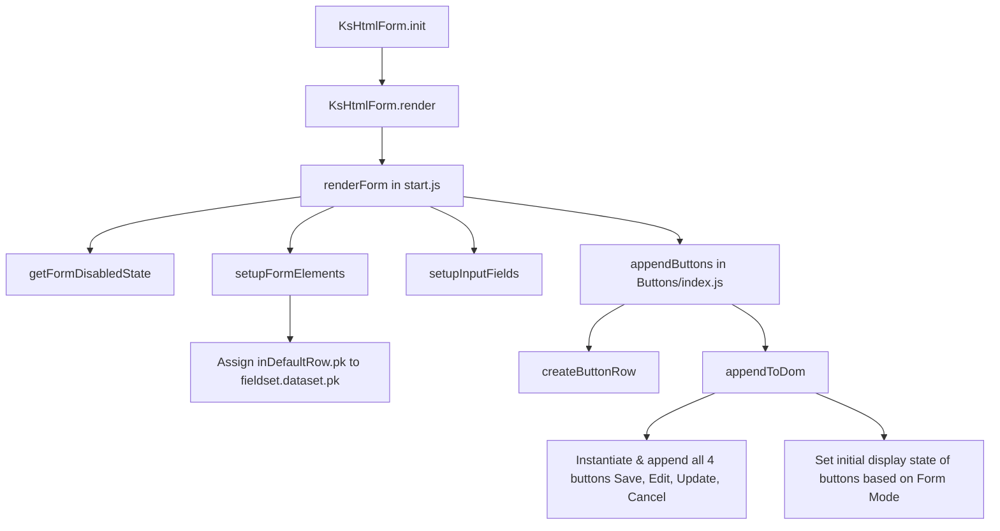

# Form and Button Lifecycle Flow (v11)

This document describes the orchestration, lifecycle, and client-side state management of the `htmlForm/v11` component.

---

## 1. Directory Structure

- `index.js`: Custom element registration (`<ks-html-form>`) and entry point.
- `render/`:
  - `start.js`: Coordinates the form rendering lifecycle.
  - `createForm.js`: Builds the wrapper `<form>` element.
  - `createFieldset.js`: Builds the `<fieldset>` element.
- `Buttons/`:
  - `index.js`: Handles button row instantiation and CSS display toggling.
  - `createSaveButton.js`: Lifecycle and action for the **Save** button.
  - `createEditButton.js`: Lifecycle and action for the **Edit** button.
  - `createUpdateButton.js`: Lifecycle and action for the **Update** button.
  - `createCancelButton.js`: Lifecycle and action for the **Cancel** button.

---

## 2. Rendering Lifecycle

1. **Initialization:** The parent element (`<ks-html-form>`) calls `init(options)` to merge configurations.
2. **Form Element Setup (`setupFormElements`):** Builds a wrapper `<form>` and a child `<fieldset>` with disabled state determined by `getFormDisabledState`.
3. **Primary Key Mapping:** The record's unique ID (`inDefaultRow.pk`) is mapped to `<fieldset data-pk="...">` inside `setupFormElements`.
4. **Input Building (`setupInputFields`):** Builds inputs using `createInputRows` and appends them to `<fieldset>`.
5. **Button Assembly:** `appendButtons` generates all four buttons (Save, Edit, Update, Cancel) and wraps them inside `
`. It determines initial visibility client-side (`style.display`).

---

## 3. Button Click Event Extraction (`attachClickEvent.js`)

When any button is clicked, the action is routed through a modular pipeline:

1. **Locate Elements:**
   - Finds the parent button: `getClosestButton(target, tagName)`
   - Finds the parent form: `getForm(element)`
2. **Extract Data:**
   - Compiles input values: `getFormData(form)`
   - Retrieves the primary key: `getPk(form)` (fetches `fieldset.dataset.pk`)
3. **Execute:** Calls `ksButton.onClick(data)` with compiled payload (including `data.pk`).

---

## 4. Client-side Interaction & Toggle Transitions

To avoid heavy DOM re-rendering, visibility changes and form edit states are updated client-side:

### Form Modes
- **Save / Create Mode:** Only the **Save** button is shown.
- **View / Read Mode:** Only the **Edit** button is shown, and the `<fieldset>` is `disabled`.
- **Edit Mode:** **Update** and **Cancel** buttons are shown, and the `<fieldset>` is enabled (its `disabled` attribute is removed).

### Actions Flow
- **Save Success:** Updates `<fieldset data-pk="...">` with the new PK returned from the database and triggers `toggleButtons` to hide Save and show Edit, disabling the fieldset.
- **Edit Click:** Hides Edit, shows Update/Cancel, and removes the `disabled` attribute from `<fieldset>`.
- **Cancel Click:** Hides Update/Cancel, shows Edit, and disables `<fieldset>`.
- **Update Success:** Saves the changes, hides Update/Cancel, shows Edit, and disables `<fieldset>`.
